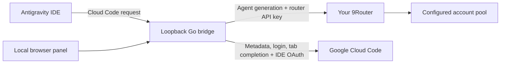

# Architecture and compatibility

The Python controller inserts the undocumented `jetski.cloudCodeUrl` user setting. The IDE's language server then calls the local bridge. No browser extension, IDE extension, certificate installation, or host override is needed. Existing IDE windows need a reload after initial configuration or removal; routing controls operate on later requests without a reload.

The Go HTTP server binds to a loopback IP. A random capability path gates access. Management writes require JSON and a same-origin request; cross-origin browser requests are rejected. Router redirects are not followed, and remote router URLs require HTTPS. IDE authorization and cookie headers are never copied to the router request. Model generation is not logged with prompt contents by the bridge.

## Routing

`v1internal:streamGenerateContent` and `v1internal:generateContent` route agent model requests to `/v1/chat/completions`. Models are prefixed with `ag/` unless already prefixed, or replaced by the panel's explicit override. `tab_` and `tab-` models retain the Google route. Other accepted Cloud Code requests go only to the allowlisted Google HTTPS endpoint.

Pause routes subsequent generation requests to Google using the IDE account. It does not cancel an in-flight router request. Account selection and failover belong to 9Router. A panel override changes the model, not the account identity.

## Wire formats

| Mode | Behavior |
| --- | --- |
| `native` | Preserves Cloud Code generation JSON and streamed response framing; requires a router that accepts that schema. |
| `openai` | Converts messages, system instructions, inline images, function calls/results, and streaming chat completions. |

The converter supports incremental text, accumulated function arguments, repeated tool names with distinct call IDs, finish reasons, and usage counters. Non-streaming IDE responses are assembled from streamed router responses.

Unsupported or restricted OpenAI conversions fail explicitly rather than silently dropping content:

- file-URI media and native built-in tools;
- `ANY` mode restricted to multiple allowed function names;
- formats outside the implemented text, inline image, and declared function schema.

Google `VALIDATED` tool mode maps to OpenAI `auto`: it permits either text or a tool call but does **not** preserve Google's stronger schema-conformance guarantee. Provider behavior and model IDs can differ; a router model being listed does not prove every IDE feature works with it.

## Verification boundary

Real Linux validation used IDE 1.107.0, cloud router generation, streaming text, and an agent tool round trip. Unit tests use synthetic payloads and mock HTTP transports. Cross-compilation covers Windows and macOS binaries; native sessions on those systems remain unverified. Linux service enablement and restart after SIGTERM were observed; a full reboot was not tested.

This is an experimental integration with an undocumented endpoint contract. Future IDE or router updates may require adapter changes. Quota metadata and autocomplete remain tied to the IDE login, so this bridge is not complete account virtualization.
